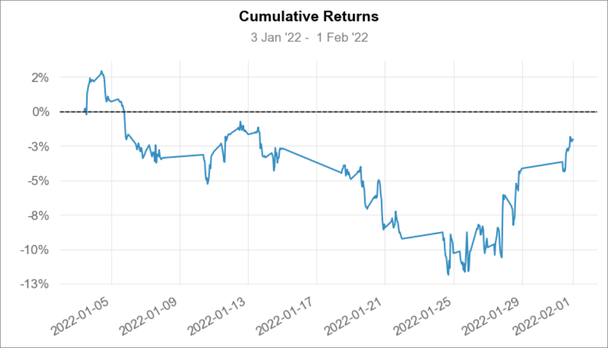
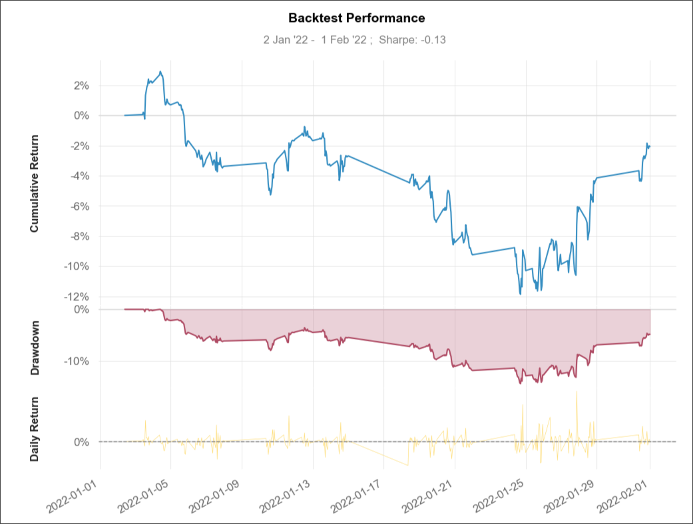

# AlphaLab Live/Paper Trading

AlphaLab Live/Paper Trading provides pre-built trading strategies for paper/live trading, allowing users to simulate or execute trades with ready-to-use strategies.

## Backtesting
Backtesting is performed using [Quantstats](https://github.com/ranaroussi/quantstats). These demonstrates the historical performance of the trading strategies, providing insights into their profitability and risk.

For more information on backtesting, see [documentation](https://quanturf-products.gitbook.io/alphalab/alphalab/backtesting).

## Join and Contribute

Welcome to **AlphaLab** community!

Discuss AlphaLab via [Discord Community](https://discord.gg/DwwqBc9nX).

<a href="https://discord.gg/DwwqBc9nX" target="\_blank">
	

		
	

</a>

If you want to contribute to AlphaLab, be sure to review the
[contribution guidelines](CONTRIBUTING.md).

We use [GitHub issues](https://github.com/Quanturf/AlphaLab-Backtesting/issues) for
tracking requests and bugs, please see
